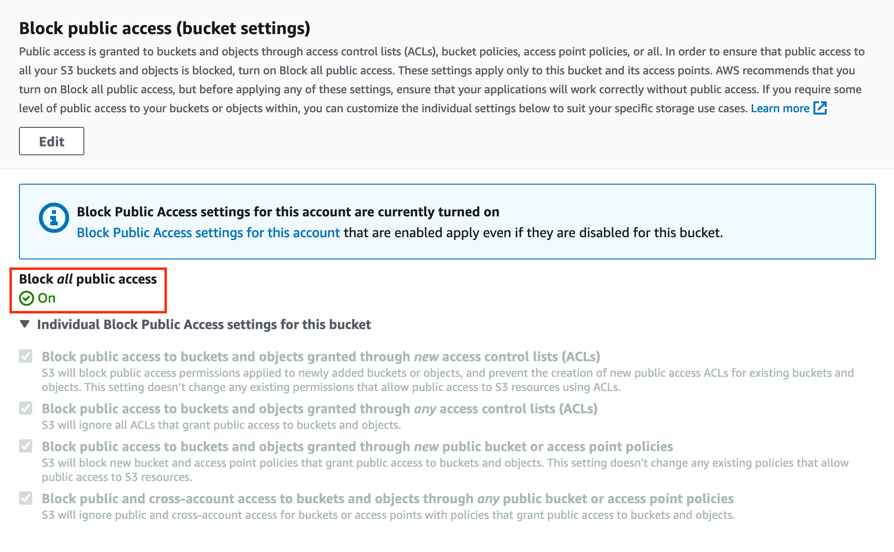
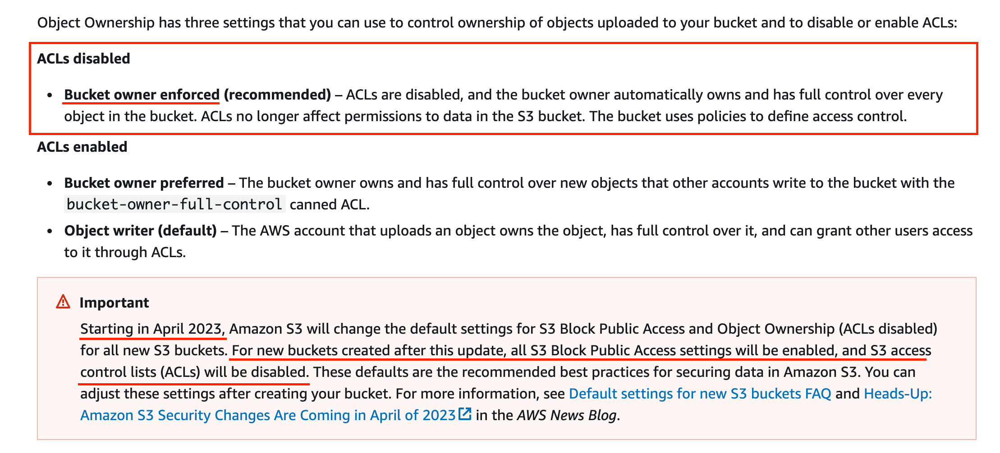
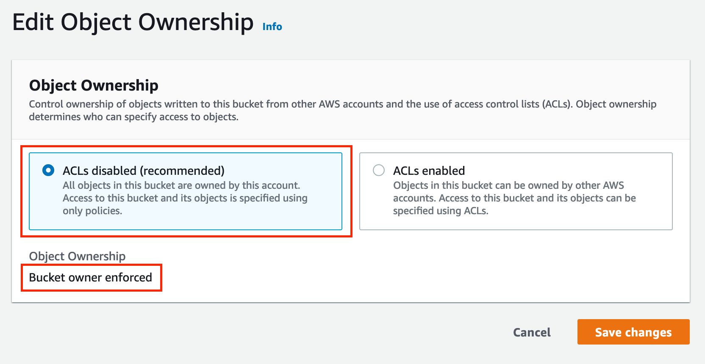
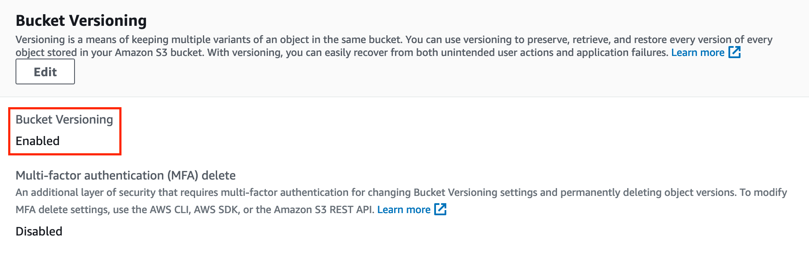

# B. Prepare remote backend

> Origin reference: [Terraform backends > S3](https://developer.hashicorp.com/terraform/language/settings/backends/s3)

- [B. Prepare remote backend](#b-prepare-remote-backend)
  - [B1. Prepare](#b1-prepare)
    - [B1-0. Set environment variables](#b1-0-set-environment-variables)
    - [B1-1. Create a new Amazon S3 Bucket](#b1-1-create-a-new-amazon-s3-bucket)
    - [B1-2. Enable block public access on bucket](#b1-2-enable-block-public-access-on-bucket)
    - [B1-3. Set object ownership to `ACLs disabled` on bucket](#b1-3-set-object-ownership-to-acls-disabled-on-bucket)
    - [B1-5. Enable versioning option on bucket](#b1-5-enable-versioning-option-on-bucket)
  - [B2. Use created Amazon S3 Backet as Remote Backend for Terraform](#b2-use-created-amazon-s3-backet-as-remote-backend-for-terraform)

## B1. Prepare

### B1-0. Set environment variables

```bash
# Set
export BACKEND_S3_REGION="ap-northeast-2"
export BACKEND_S3_BUCKET="cloudfront-for-next-js-$(date '+%y%m%d-%H%M%S')"

# Check
env | egrep "BACKEND_S3_"
```

### B1-1. Create a new Amazon S3 Bucket

```bash
# Create a new Bucket
aws s3api create-bucket \
    --region ${BACKEND_S3_REGION} \
    --bucket ${BACKEND_S3_BUCKET} \
    --create-bucket-configuration "LocationConstraint=${BACKEND_S3_REGION}" \
    --output json | jq

# Check
aws s3api list-buckets \
    --region ${BACKEND_S3_REGION} \
    --query "Buckets[?Name == \`${BACKEND_S3_BUCKET}\`]" \
    --output json | jq ".[0]"
```

The result maybe like this.

```json
{
  "Name": "cloudfront-for-next-js-yymmdd-HHMMSS",
  "CreationDate": "yyyy-mm-ddTHH:MM:SS+00:00"
}
```

- References:
  - [create-bucket: examples](https://awscli.amazonaws.com/v2/documentation/api/latest/reference/s3api/create-bucket.html#examples)
  - [list-buckets: examples](https://awscli.amazonaws.com/v2/documentation/api/latest/reference/s3api/list-buckets.html#examples)

### B1-2. Enable block public access on bucket

```bash
aws s3api put-public-access-block \
    --region ${BACKEND_S3_REGION} \
    --bucket ${BACKEND_S3_BUCKET} \
    --public-access-block-configuration "BlockPublicAcls=true,IgnorePublicAcls=true,BlockPublicPolicy=true,RestrictPublicBuckets=true"

# Check
aws s3api get-public-access-block \
    --region ${BACKEND_S3_REGION} \
    --bucket ${BACKEND_S3_BUCKET} \
    --output json | jq
```

[**IMPORTANT!!**] The result **must** be same with below json block.

```json
{
  "PublicAccessBlockConfiguration": {
    "BlockPublicAcls": true,
    "IgnorePublicAcls": true,
    "BlockPublicPolicy": true,
    "RestrictPublicBuckets": true
  }
}
```

You can also check in console at `Permission > Block public access (bucket settings)` like this:



- References:
  - [put-public-access-block: examples](https://awscli.amazonaws.com/v2/documentation/api/latest/reference/s3api/put-public-access-block.html#examples)
  - [get-public-access-block: examples](https://awscli.amazonaws.com/v2/documentation/api/latest/reference/s3api/get-public-access-block.html#examples)

### B1-3. Set object ownership to `ACLs disabled` on bucket

> [What is Obejct Ownership?](https://docs.aws.amazon.com/AmazonS3/latest/userguide/about-object-ownership.html#object-ownership-overview)
>
> 

```bash
aws s3api put-bucket-ownership-controls \
    --region ${BACKEND_S3_REGION} \
    --bucket ${BACKEND_S3_BUCKET} \
    --ownership-controls "Rules=[{ObjectOwnership=BucketOwnerEnforced}]"

# Check
aws s3api get-bucket-ownership-controls \
    --region ${BACKEND_S3_REGION} \
    --bucket ${BACKEND_S3_BUCKET} \
    --output json | jq
```

[**IMPORTANT!!**] The result **must** be same with below json block.

```json
{
  "OwnershipControls": {
    "Rules": [
      {
        "ObjectOwnership": "BucketOwnerEnforced"
      }
    ]
  }
}
```

You can also check in console at `Permission > Object Ownership` like this:



- References:
  - [put-bucket-ownership-controls: examples](https://awscli.amazonaws.com/v2/documentation/api/latest/reference/s3api/put-bucket-ownership-controls.html)
  - [get-bucket-ownership-controls: examples](https://awscli.amazonaws.com/v2/documentation/api/latest/reference/s3api/get-bucket-versioning.html#examples)

### B1-5. Enable versioning option on bucket

```bash
aws s3api put-bucket-versioning \
    --region ${BACKEND_S3_REGION} \
    --bucket ${BACKEND_S3_BUCKET} \
    --versioning-configuration Status=Enabled

# Check
aws s3api get-bucket-versioning \
    --region ${BACKEND_S3_REGION} \
    --bucket ${BACKEND_S3_BUCKET} \
    --output json | jq
```

The result **must** be same with below json block.

```json
{
  "Status": "Enabled"
}
```

You can also check in console at `Properties > Bucket Versioning` like this:



- References:
  - [put-bucket-versioning: examples](https://awscli.amazonaws.com/v2/documentation/api/latest/reference/s3api/put-bucket-versioning.html#examples)
  - [get-bucket-versioning: examples](https://awscli.amazonaws.com/v2/documentation/api/latest/reference/s3api/get-bucket-versioning.html#examples)

## B2. Use created Amazon S3 Backet as Remote Backend for Terraform

```bash
# Check
env | egrep "BACKEND_S3_"

# Preview 
envsubst < .history/backend.template

# Create backend.tf file
envsubst < .history/backend.template > backend.tf
```

- Check this files:
  - [`.history/backend.template`](backend.template)
  - [`.gitignore`](../.gitignore#L1-L2)

```bash
# Initiation
terraform init

# Check
terrafrom plan
```
