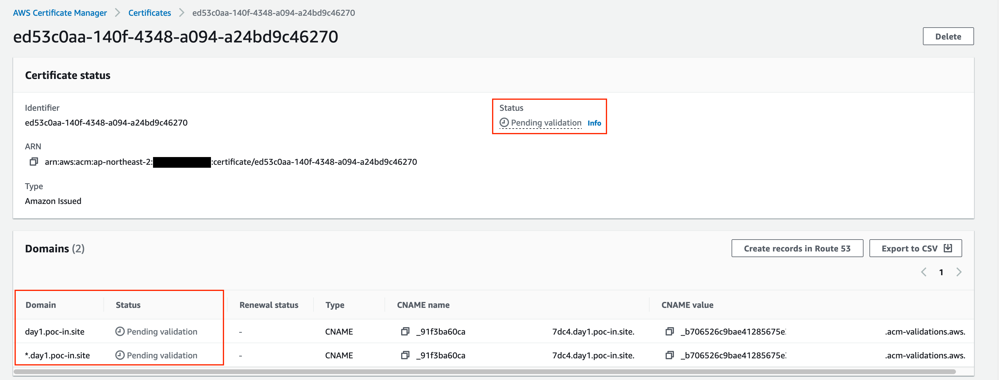
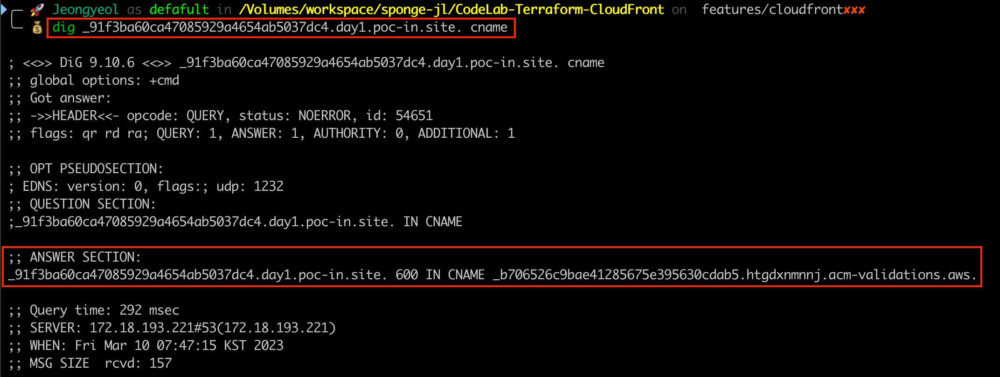
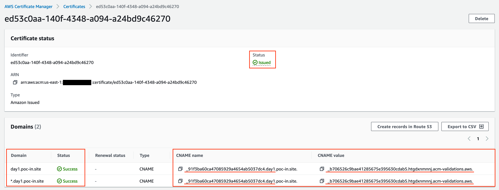
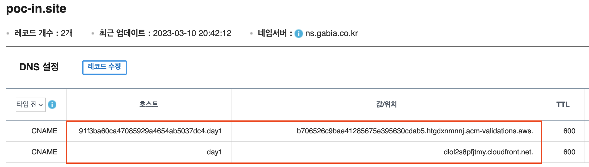

# CodeLab-Terraform-CloudFront

TODO: svg

D2 source: [`.diagram/cloudfront-for-next-js.d2`](.diagram/cloudfront-for-next-js.d2)

- [CodeLab-Terraform-CloudFront](#codelab-terraform-cloudfront)
  - [Quick start](#quick-start)
  - [Requirements](#requirements)
  - [Providers](#providers)
  - [Modules](#modules)
  - [Resources](#resources)
  - [Inputs](#inputs)
  - [Outputs](#outputs)
  - [History](#history)
  - [ETC](#etc)
    - [ACM Certificate](#acm-certificate)
    - [DNS Records](#dns-records)

## Quick start

```bash
# Download required modules
terraform init
```

```bash
# AWS Profile
export AWS_PROFILE="MY_PROFILE"
aws sts get-caller-identity --output json | jq

# Format
terraform fmt -recursive

# Plan
terraform plan -var-file=input.auto.tfvars

# Provision
terraform apply -var-file=input.auto.tfvars
```

Try deploy command on your static contents

```bash
# Set environment variables
export TARGET_S3_BUCKET_NAME="day1.poc-in.site"
export TARGET_CF_DISTRIBUTION_ID="_CHECK_TERRAFORM_OUTPUT_" # dist_id_for_refresh
env | grep "TARGET_"

# Deploy using sync the all static contents in current directory to S3 bucket
aws s3 sync --color=on \
  "./" \
  "s3://${TARGET_S3_BUCKET_NAME}/"

# Refresh CloudFront Cache
aws cloudfront create-invalidation \
  --paths "/*" \
  --distribution-id "${TARGET_CF_DISTRIBUTION_ID}" | jq
```

<!-- BEGINNING OF PRE-COMMIT-TERRAFORM DOCS HOOK -->
## Requirements

| Name | Version |
|------|---------|
| <a name="requirement_terraform"></a> [terraform](#requirement\_terraform) | 1.3.9 |
| <a name="requirement_aws"></a> [aws](#requirement\_aws) | ~> 4.55.0 |

## Providers

No providers.

## Modules

| Name | Source | Version |
|------|--------|---------|
| <a name="module_distribution"></a> [distribution](#module\_distribution) | ./cloudfront_for_static_distribution | n/a |
| <a name="module_ssl_certi_for_distribution"></a> [ssl\_certi\_for\_distribution](#module\_ssl\_certi\_for\_distribution) | ./acm_certificate_for_ssl_certification | n/a |
| <a name="module_statics_destination"></a> [statics\_destination](#module\_statics\_destination) | ./s3_bucket_for_static_contents | n/a |

## Resources

No resources.

## Inputs

| Name | Description | Type | Default | Required |
|------|-------------|------|---------|:--------:|
| <a name="input_common_tags"></a> [common\_tags](#input\_common\_tags) | System tags to be applied to all components. | `map(any)` | n/a | yes |
| <a name="input_region"></a> [region](#input\_region) | Target region name on provision | `string` | `"ap-northeast-2"` | no |
| <a name="input_svc_app_name"></a> [svc\_app\_name](#input\_svc\_app\_name) | Target service application name | `string` | n/a | yes |
| <a name="input_svc_root_domain"></a> [svc\_root\_domain](#input\_svc\_root\_domain) | Owned domain name for the website of service. | `string` | n/a | yes |

## Outputs

| Name | Description |
|------|-------------|
| <a name="output_dist_domain_name_for_CNAME_name"></a> [dist\_domain\_name\_for\_CNAME\_name](#output\_dist\_domain\_name\_for\_CNAME\_name) | ======================================== // CF: Contents Delivery Network ======================================== |
| <a name="output_dist_domain_name_for_CNAME_value"></a> [dist\_domain\_name\_for\_CNAME\_value](#output\_dist\_domain\_name\_for\_CNAME\_value) | n/a |
| <a name="output_dist_id_for_refresh"></a> [dist\_id\_for\_refresh](#output\_dist\_id\_for\_refresh) | n/a |
| <a name="output_dist_viewer_certificate"></a> [dist\_viewer\_certificate](#output\_dist\_viewer\_certificate) | n/a |
| <a name="output_ssl_certi_certificate_chain"></a> [ssl\_certi\_certificate\_chain](#output\_ssl\_certi\_certificate\_chain) | n/a |
| <a name="output_ssl_certi_domain_name"></a> [ssl\_certi\_domain\_name](#output\_ssl\_certi\_domain\_name) | n/a |
| <a name="output_ssl_certi_status"></a> [ssl\_certi\_status](#output\_ssl\_certi\_status) | ======================================== // ACM: Managed SSL Certification ======================================== |
| <a name="output_ssl_certi_validation_method"></a> [ssl\_certi\_validation\_method](#output\_ssl\_certi\_validation\_method) | n/a |
| <a name="output_statics_destination_bucket_name"></a> [statics\_destination\_bucket\_name](#output\_statics\_destination\_bucket\_name) | ======================================== // S3: Deployment Destiation ======================================== |
<!-- END OF PRE-COMMIT-TERRAFORM DOCS HOOK -->

## History

- [Prerequisites](.setup-history/a-prerequisites.md#a-prerequisites)
- [Remote Backend](.setup-history/b-remote-backend.md#b-prepare-remote-backend)

## ETC

### ACM Certificate

1. During provisioning with new certificate validation:

    

2. After update the DNS record about CNAME name & value:

    

    

### DNS Records


